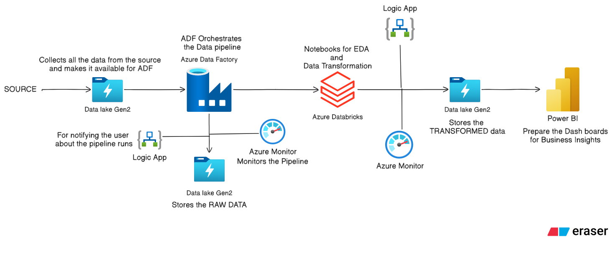
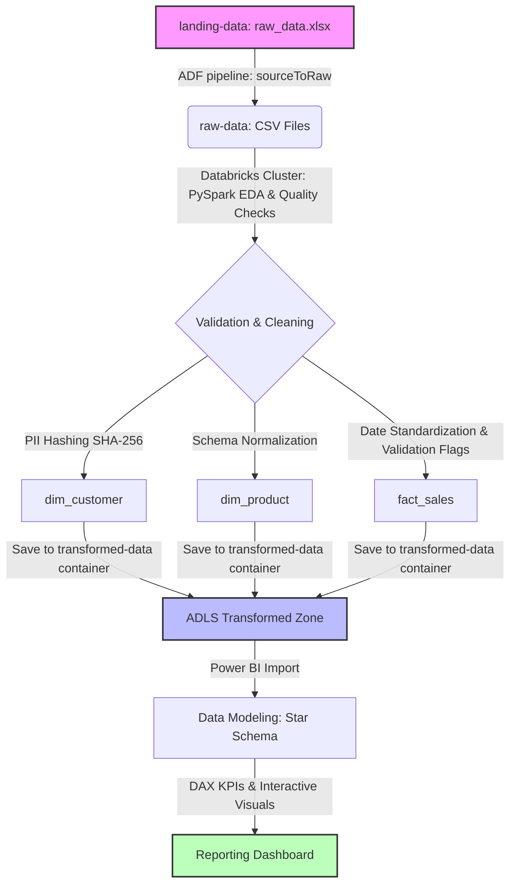

# Retail Sales Data Pipeline & Business Insights Generation

[](https://www.python.org/)
[](https://azure.microsoft.com/)
[](https://azure.microsoft.com/en-us/products/data-factory/)
[](https://azure.microsoft.com/en-us/products/databricks/)
[](https://spark.apache.org/)
[](https://powerbi.microsoft.com/)
[](https://github.com/)

An end-to-end cloud data engineering and business intelligence solution designed to ingest, process, validate, clean, secure, and visualize retail sales data. This project showcases a robust, production-grade cloud architecture for processing raw multi-source transactional data into clean, business-ready datasets structured in a Star Schema and visualizing key business performance indicators.

---

## Project Objective

ABC Retail Solutions is a multinational retail corporation operating across multiple cities through both online and offline channels. The organization collects large volumes of transactional data from various source systems to support business reporting, performance monitoring, and strategic decisions. 

### The Business Problem
The raw data received from multiple operational sources contains several data quality and compliance issues:
* **Duplicate Transactions:** Identical transaction IDs with differing outcomes causing inflation of order counts.
* **Missing Values:** Key metrics like product prices missing from transaction rows.
* **Schema Inconsistencies:** Mismatches in product naming conventions and product categories between transactional records and the master catalog.
* **Data Anomaly:** Negative quantities and negative discount values causing skewed financial metrics.
* **Unstandardized Columns:** Dates formatted inconsistently (e.g., `yyyy-MM-dd`, `MM-dd-yyyy`, `dd-MM-yyyy`) as string fields.
* **Compliance Risk:** Exposure of raw customer Personally Identifiable Information (PII) such as plaintext email addresses and phone numbers.

### Solution Rationale
This solution was built to establish a secure, automated, and scalable cloud data pipeline. By validating inputs, cleaning anomalies, isolating entities, and masking sensitive fields, the pipeline ensures data accuracy and regulatory compliance (GDPR/CCPA) before data is consumed for analytical reporting.

### Expected Business Outcome
The final outcome is a single source of truth for business reporting. It enables corporate stakeholders to monitor accurate financial KPIs (Revenue, Average Order Value, Orders) and analyze sales trends across products, categories, time, and geographies through an interactive Power BI dashboard.

---

## Solution Overview

The project implements a modern cloud data lakehouse pattern split into progressive zones:
1. **Landing Zone:** External file intake area storing raw Excel data sheets.
2. **Raw Zone:** Standardized CSV ingestion layer.
3. **Transformation Zone:** Cleaned, masked, and structured dimensional datasets (Parquet/CSV formats).
4. **Reporting Zone:** Semantic Star Schema model consumed by business intelligence dashboards.

The orchestration of ingestion is handled by **Azure Data Factory (ADF)**, while distributed processing, validation, and transformations are executed using **PySpark** inside **Azure Databricks**. Pipeline status events are routed through **Azure Monitor** and triggers **Azure Logic Apps** for email alerting.

---

## System Architecture

The architecture flow maps the pipeline from ingestion to final reporting:



### 1. Landing Layer
* **Storage:** Azure Data Lake Storage (ADLS) Gen2 container (`landing-data`).
* **Content:** Incoming multi-sheet Excel file `raw_data.xlsx` containing sheets for `PRODUCT DETAILS`, `RETAIL DATA 1`, and `RETAIL DATA 2`.
* **Purpose:** Serves as the immutable landing zone, preserving raw files in their original business state.

### 2. Raw Layer
* **Storage:** ADLS Gen2 container (`raw-data`).
* **Ingestion:** Managed by Azure Data Factory via the copy pipeline `sourceToRaw`.
* **Conversion:** The pipeline reads the Excel sheets, converts them into delimited CSV format, and writes them as `product_details.csv`, `retail_data.csv`, and `retail_data2.csv`.
* **Orchestration & Notification:** Monitored via Azure Monitor. Web Activities at the end of the pipeline trigger an Azure Logic App workflow to send Gmail success/failure notifications.

### 3. Transformation Layer
* **Compute:** Azure Databricks Spark Cluster.
* **Operations:** Databricks notebooks run PySpark programs to perform:
  * Exploratory Data Analysis (EDA) and profiling.
  * Data quality enforcement (null checks, validation rules).
  * Data normalization and PII masking (SHA-256 hashing).
  * Table splitting into Dimensions (`dim_product`, `dim_customer`) and Facts (`fact_sales`).
* **Storage:** Cleaned, structured outputs are saved to the `transformed-data` container.

### 4. Reporting Layer
* **BI Platform:** Power BI.
* **Model:** Imports the transformed CSV directories, builds a Star Schema relationship model, defines DAX measurements, and serves interactive dashboards to business users.

---

## Technology Stack

* **Python:** Applied for custom regex patterns, scripting, and notebook validations.
* **Microsoft Azure:** Cloud provider hosting the data infrastructure.
* **Azure Data Factory (ADF):** Ingestion orchestrator executing copy activities and notifying downstream endpoints.
* **Azure Data Lake Storage Gen2 (ADLS):** Object storage organized hierarchically using three logical containers: `landing-data`, `raw-data`, and `transformed-data`.
* **Azure Databricks:** Managed Spark compute platform utilized for writing distributed ETL code.
* **PySpark (Apache Spark):** Processing framework used to join datasets, filter anomalies, perform PII hashing, standardize dates, and save partitioned outputs.
* **Azure Monitor:** Track execution pipelines and diagnostic logs.
* **Azure Logic Apps:** Event-driven workflow triggered via HTTP webhooks to send automated email alerts on pipeline status.
* **Power BI:** Data visualization platform used to model relationships, build calculations, and report KPIs.
* **GitHub:** Version control platform.

---

## Project Workflow



1. **Data Ingestion:** A schedule trigger (`FirstTrigger`) runs the ADF pipeline `sourceToRaw` every 15 hours. The pipeline copies sheets from `raw_data.xlsx` in `landing-data` into separate CSV files in `raw-data`.
2. **Data Storage:** Files are staged inside raw storage to preserve the record states before transformations.
3. **Data Validation:** Spark processes the files, checking structure, counting nulls, scanning formatting, and identifying columns with high data redundancy or validation failures.
4. **Data Transformation:** 
   * Strips redundant descriptive fields from transaction sheets.
   * Standardizes strings, normalizes pricing, and reformats date representations.
5. **PII Protection:** Hashing algorithms apply SHA-256 masking to secure customer identities before storing records.
6. **Data Modeling:** The outputs are separated into a dimensional layout (Dimension and Fact tables) representing a classic Star Schema.
7. **Dashboard Development:** Power BI imports the dimensional tables, maps relationships, defines measures, and constructs the report sheets.
8. **Monitoring and Notifications:** Azure Monitor logs run identifiers. The ADF pipeline initiates a Logic App HTTP trigger POST request on success or failure, dispatching status emails to the engineering team.

---

## Dataset Overview

### Source Datasets
The ingestion pipeline processes a multi-sheet Excel file `raw_data.xlsx` consisting of:
* **Product Details:** Catalog containing product mappings and master retail prices.
* **Retail Data 1:** Raw transaction log from operational system 1.
* **Retail Data 2:** Raw transaction log from operational system 2.

### Schema Profiles
| Dataset / Sheet | Primary Fields | Record Count | Quality Issues Found |
| :--- | :--- | :--- | :--- |
| **Product Details** | `product_id`, `product_name`, `category`, `price` | ~1,000 | Complete, clean reference list. |
| **Retail Data 1** | `transaction_id`, `customer_id`, `customer_name`, `product_id`, `price`, `product_name`, `category`, `purchase_location`, `city`, `transaction_date`, `quantity`, `payment_method`, `discount`, `email`, `phone`, `payment_status` | 4,243 | Missing prices, redundant product strings, unstandardized dates, exposed email/phone PII, negative quantities. |
| **Retail Data 2** | Same structure as Retail Data 1 | 4,251 | Similar issues as Retail Data 1, missing prices, exposed PII, negative quantities. |

### Final Curated Datasets
Transformations output three distinct physical tables written in CSV format under the `transformed-data` container:
1. **`dim_product` (Products Dimension):** Contains unique, validated catalog details.
   * *Columns:* `product_id`, `product_name`, `category`, `price`
2. **`dim_customer` (Customers Dimension):** Consolidates unique customer profiles across both retail datasets, stripping out raw contact coordinates.
   * *Columns:* `customer_id`, `customer_name`, `email_hash`, `phone_hash`
3. **`fact_sales` (Sales Fact Table):** Normalized sales transactions storing business keys and metrics.
   * *Columns:* `transaction_id`, `customer_id`, `product_id`, `quantity`, `valid_quantity`, `city`, `transaction_date`, `purchase_mode`, `payment_method`, `discount`, `valid_discount`, `payment_status`

---

## Data Quality Checks

Specific data quality scripts were developed within Databricks to clean raw data:

* **Null Handling:** Identified that the `price` column was the only field containing nulls in the raw retail tables. This was resolved by removing `price` entirely from the sales data and sourcing the correct, complete pricing values directly from the `Product Details` dimension.
* **Duplicate Handling:** Scanned `transaction_id` columns. Found 243 duplicate IDs in Retail Data 1 and 251 in Retail Data 2. Detail analysis showed these were not true duplicate records; rather, they represented split payment records with differing payment statuses ("Successful" vs. "Failed"). They were kept to preserve audit trails.
* **Product Validation:** Inner joins confirmed that all `product_id` values listed in sales records had matching keys in the `Product Details` catalog (100% referential integrity).
* **Customer Validation:** Deduped customer profiles across both retail sources, resulting in a reduction from 8,494 transaction rows to 1,963 unique, clean customer profiles.
* **Email Validation:** Evaluated via PySpark using regular expressions:
  ```python
  email_regex = r"^[A-Za-z0-9._%+-]+@[A-Za-z0-9.-]+\.[A-Za-z]{2,}$"
  df.filter(col("email").rlike(email_regex))
  ```
  Only rows matching this standard format were processed.
* **Phone Validation:** Converted numerical phone inputs into string types, removed any non-digit formatting characters, and confirmed that the final phone sequence contained exactly 10 digits:
  ```python
  length(regexp_replace(col("phone").cast("string"), r"\D", "")) == 10
  ```
* **Date Validation:** Standardized transaction dates. Raw files contained multiple text formats. The code dynamically parses formats and standardizes them into `yyyy-MM-dd`:
  * If the first part of the date split (by `-`) is > 31, it is parsed as `yyyy-MM-dd`.
  * If the first part is > 12 (and <= 31), it is parsed as `dd-MM-yyyy`.
  * Otherwise, it is parsed as `MM-dd-yyyy`.
  Standardized dates are cast to Spark's `DateType` for logical time intelligence.
* **Quantity Validation:** Quantity values were verified. Records containing quantities < 0 were not dropped (to preserve operational history), but flagged as "Invalid" under a new column `valid_quantity`. Valid transactions (quantities >= 0) are flagged as "Valid".
* **Discount Validation:** Discount values were checked. Values >= 0 are flagged as "Valid", while values < 0 are flagged as "Invalid" under `valid_discount`.

---

## Data Transformation Decisions

To enforce data warehousing standards and performance efficiency, the following design decisions were implemented in [Data Transformation Pipeline.py](code/Data%20Transformation%20Pipeline.py):

* **Redundancy Reduction (Normalization):** Raw transaction logs contained `product_name`, `category`, and `price` columns. These columns were prone to naming inconsistencies and null values. Removing them from the transactional records and routing queries through the `dim_product` table reduced storage size and unified naming conventions.
* **Customer Extraction:** In raw datasets, customer names and emails were duplicated across transaction lines. We extracted unique rows, ran validation, and loaded them into a dedicated customer table (`dim_customer`). This design reduced customer records to 1,963 rows, optimizing data governance and memory management.
* **PII Protection (Compliance):** Placed customer email and phone columns under SHA-256 cryptographic hashing. The raw contact coordinates were omitted from the final tables:
  ```python
  df.withColumn("email_hash", sha2(col("email"), 256))
    .withColumn("phone_hash", sha2(col("phone").cast("string"), 256))
  ```
* **Auditability over Deletion:** Instead of deleting transactions containing invalid metrics (such as negative quantities or discounts), the pipeline appends validation flags (`valid_quantity` and `valid_discount`). This preserves data integrity for compliance and returns raw audit capability to analytical users.
* **Text Standardization:** Capitalized string values (e.g., converting mixed-case `payment_status` using the Spark `initcap` function to values like "Successful" and "Failed") to establish clean, predictable categorization for reporting.

---

## Data Model

The transformed tables are loaded into Power BI and modeled using a **Star Schema** to enable high-performance analytics:

```
                  +-----------------------+
                  |      dim_product      |
                  +-----------------------+
                  | product_id   (PK)     |
                  | product_name          |
                  | category              |
                  | price                 |
                  +-----------+-----------+
                              | 1
                              |
                              | M
+------------------+     +----+------------------+     +-------------------+
|   dim_customer   |     |      fact_sales        |     |     dim_date      |
+------------------+     +-----------------------+     +-------------------+
| customer_id (PK) +-----+ customer_id      (FK) |     | date         (PK) |
| customer_name    | 1 M | product_id       (FK) |   M | date_id           |
| email_hash       |     | transaction_date (FK) +-----+ year              |
| phone_hash       |     | transaction_id        |   1 | month             |
+------------------+     | quantity              |     | day               |
                         | valid_quantity        |     +-------------------+
                         | city                  |
                         | purchase_mode         |
                         | payment_method        |
                         | discount              |
                         | valid_discount        |
                         | payment_status        |
                         +-----------------------+
```

### Table Relationships
* **`dim_product` to `fact_sales`:** One-to-Many (`1` to `*`) join using `product_id`.
* **`dim_customer` to `fact_sales`:** One-to-Many (`1` to `*`) join using `customer_id`.
* **`dim_date` to `fact_sales`:** One-to-Many (`1` to `*`) join using the formatted `transaction_date` column.

This layout simplifies filters, minimizes joins, and ensures that aggregations run efficiently under Power BI's VertiPaq engine.

---

## Project Structure

Below is the repository directory tree detailing the files and their purpose:

```
retails-sales-data-pipeline/
├── code/
│   ├── Data Transformation Pipeline.py    # PySpark transformation script executed in Databricks
│   ├── Eda_on_product_details.py         # PySpark profiling script for product catalog reference data
│   ├── Eda_on_retail_data1.py            # PySpark profiling script for raw retail transaction system 1
│   └── Eda_on_retail_data2.py            # PySpark profiling script for raw retail transaction system 2
├── notebooks/
│   ├── Data Transformation Pipeline.ipynb # Databricks transformation notebook
│   ├── Eda_on_product_details.ipynb      # EDA notebook profiling product reference data
│   ├── Eda_on_retail_data1.ipynb         # EDA notebook profiling retail dataset 1
│   └── Eda_on_retail_data2.ipynb         # EDA notebook profiling retail dataset 2
├── dataFactory/
│   ├── dataset/
│   │   ├── Product_details.json          # Target CSV metadata configuration for raw product catalog
│   │   ├── raw_data.json                 # Source Excel sheet dataset configuration
│   │   ├── retail_data1.json             # Target CSV metadata configuration for raw retail data 1
│   │   └── retail_data2.json             # Target CSV metadata configuration for raw retail data 2
│   ├── factory/
│   │   └── reatil-sales-adf.json         # Data Factory global properties configuration
│   ├── integrationRuntime/
│   │   └── integrationRuntime2.json      # Ingestion runtime configuration
│   ├── linkedService/
│   │   └── AzureDataLakeStorage1.json    # Secure ADLS Gen2 connector configuration details
│   ├── pipeline/
│   │   └── sourceToRaw.json              # ADF pipeline definition copy sequence and Logic App notifications
│   ├── trigger/
│   │   └── FirstTrigger.json             # Recurrence schedule trigger (every 15 hours)
│   └── publish_config.json               # ADF deployment environment mappings
├── power_bi/
│   └── dashboard.pbix                    # Power BI file with semantic models, DAX, and reports
├── documentation/
│   ├── project_documentation.docx         # Project specifications and details (Word Document)
│   └── project_documentation.pdf          # Project specifications and details (PDF File)
├── images/
│   └── system-architecture.png           # Pipeline architecture diagram image
└── README.md                             # Comprehensive project documentation
```

---

## Future Enhancements

* **Incremental Loading with Delta Lake:** Convert the current overwrite CSV pattern into Delta tables, leveraging `Delta Lake` format to implement incremental loads, file compaction, ACID transactions, and Time Travel features.
* **Secrets Protection via Key Vault:** Replace standard Databricks scope-configured storage access keys with dynamic secret references linked directly to `Azure Key Vault` to improve credential security.
* **Continuous Integration/Deployment (CI/CD):** Introduce GitHub Actions workflows to automate notebook synchronization to Databricks workspaces and deploy ADF resource templates across DEV/TEST/PROD environments.
* **Automated Data Quality Testing:** Integrate PyTest scripts into code execution stages to validate Spark transformation outputs automatically.
* **Log Analytics Integration:** Forward diagnostics from Azure Monitor into a Log Analytics Workspace to build operational monitoring dashboards for run status trends.

---

## Acknowledgement

This end-to-end cloud pipeline served as a practical learning journey in data engineering concepts:
* Deploying and configuring Azure resources (ADLS Gen2, Azure Data Factory, Logic Apps).
* Managing serverless Spark compute, handling clusters, and developing distributed code in Databricks.
* Profiling datasets, creating schemas, cleaning data anomalies, and applying cryptographic PII hashing.
* Implementing Star Schema data models and visualizing business KPIs within Power BI.

---

## Thank You Note

Thank you for visiting my project repository! If you are a recruiter, hiring manager, or fellow data engineer, I hope this project demonstrates my technical capability and structured approach to building production-grade data pipelines. 

Feel free to open an issue or reach out directly if you have any questions or feedback. I am always open to discussing data architectures and engineering best practices!

* Sayan Mondal ([CMRIT](https://www.cmrit.ac.in/), Bangalore)
* Date: 02/06/2026
